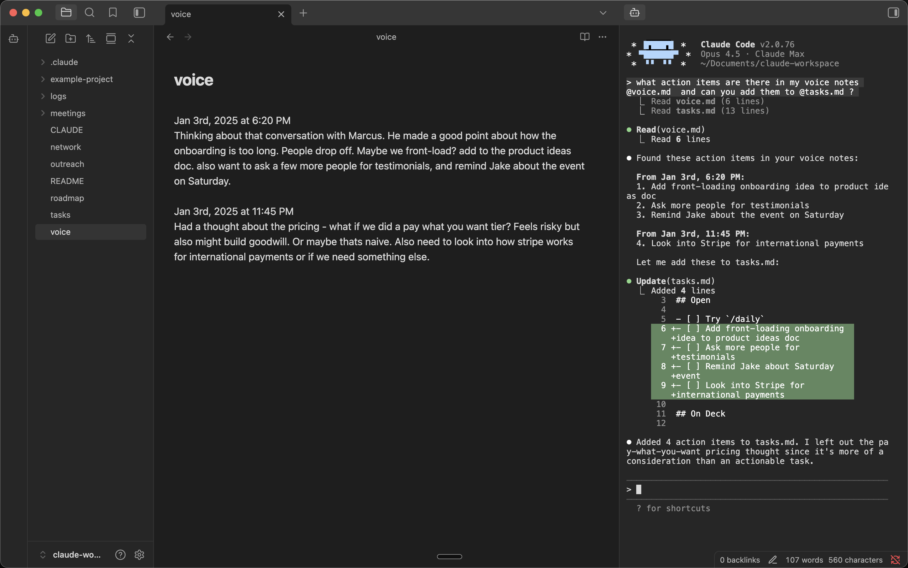

# Pi Sidebar

Run [Pi](https://pi.dev) (and other agent CLIs) in your Obsidian sidebar.

Built by [Tim Koopmans](https://github.com/timkoopmans). Forked from [obsidian-claude-sidebar](https://github.com/derek-larson14/obsidian-claude-sidebar) by Derek Larson.



## Features

- **Auto-launches Pi** - Pi starts automatically
- **Multiple tabs** - Run multiple Pi instances side by side
- **Embedded Pi** - Full terminal with Pi in your Obsidian sidebar
- **Folder & file context menu** - Right-click any folder to open Pi in that directory, or a file to send path to Pi
- **Multi-backend** - Switch between Pi, Claude Code, Codex, OpenCode, Gemini, Kimi Code, GitHub Copilot, and Cursor Agent in settings, or via **Switch CLI provider…** in the command palette

## Requirements

- macOS, Linux, or Windows
- Python 3
- An agent CLI — [Pi](https://pi.dev) (default), or any other [supported backend](#features)

## Installation

### Manual Installation (Mac/Linux)

In your vault folder, run:
```bash
mkdir -p .obsidian/plugins/pi-sidebar && cd .obsidian/plugins/pi-sidebar && \
  curl -LO https://github.com/timkoopmans/obsidian-pi-sidebar/releases/latest/download/main.js && \
  curl -LO https://github.com/timkoopmans/obsidian-pi-sidebar/releases/latest/download/manifest.json && \
  curl -LO https://github.com/timkoopmans/obsidian-pi-sidebar/releases/latest/download/styles.css
```

Then in Obsidian: Settings → Community Plugins → Refresh → Enable "Pi Sidebar".

### Manual Updating

In your vault folder, run:
```bash
cd .obsidian/plugins/pi-sidebar && \
  curl -LO https://github.com/timkoopmans/obsidian-pi-sidebar/releases/latest/download/main.js && \
  curl -LO https://github.com/timkoopmans/obsidian-pi-sidebar/releases/latest/download/manifest.json && \
  curl -LO https://github.com/timkoopmans/obsidian-pi-sidebar/releases/latest/download/styles.css
```

Then restart Obsidian or disable/re-enable the plugin.

### Windows Setup

After installing the plugin, add Windows-specific dependencies:

1. Install Python 3 from [python.org](https://python.org)
2. Install pywinpty into the Python the plugin will use:
```bash
py -m pip install pywinpty
```

Use `py -m pip` (not just `pip`) to avoid installing into a different Python interpreter than the one the plugin selects. If you see "pywinpty not installed" in the sidebar after installing, the error message will print the exact interpreter path — install pywinpty into that one.

3. Pick whether to run Pi inside WSL or natively in `cmd.exe`. Configure in **Settings → Pi Sidebar → Shell** (Windows only — Linux/macOS always run `bash`):

| Option | Spawns | Path translation |
|--------|--------|------------------|
| cmd.exe (default) | `cmd.exe` | none |
| wsl.exe (WSL) | `wsl.exe` | Windows paths → Linux paths via `wslpath` |

Use `wsl.exe` when your Pi install, Node, or git toolchain lives in a WSL distro. Vault paths sent to Pi (file path command, selection context, drag-drop, image paste, wikilink references) are converted to Linux form before reaching the CLI. Translation respects a custom `/etc/wsl.conf` `[automount]` root, so paths still resolve if your `C:\` mounts at `/c/` instead of `/mnt/c/`.

## Usage

- Click the bot icon in the left ribbon to open Pi
- Right-click the bot icon for folder targeting or resuming a conversation
- Right-click any folder for "Open Pi here"
- Use Command Palette (`Cmd+P`) for all commands:
  - **Open Pi** / **New Pi Tab** / **Close Pi Tab**
  - **Toggle Focus: Editor ↔ Pi** - Quick switch between editor and Pi
  - **Run Pi from this folder** - Start Pi in the active file's directory
  - **Resume last conversation** - Pick up where you left off (`--continue`)
  - **Send File Path to Pi** / **Send Selection to Pi**
- Press `Shift+Enter` for multi-line input
- Set your own hotkeys in Settings → Hotkeys

## Platform Support

| Platform | Status |
|----------|--------|
| macOS | ✅ Supported |
| Linux | ✅ Supported |
| Windows | ✅ Supported |

## How It Works

- [xterm.js](https://xtermjs.org/) for terminal emulation
- Python's built-in `pty` module for pseudo-terminal support (macOS/Linux)
- [pywinpty](https://github.com/andfoy/pywinpty) for Windows PTY support

## Development

The PTY scripts (`terminal_pty.py` for Unix, `terminal_win.py` for Windows) are embedded as base64 in `main.js` for Obsidian plugin directory compatibility. To rebuild after modifying:

```bash
./build.sh
```

## Contributing

Hit a bug or want to develop a new feature? Point your coding agent at `CLAUDE.md` in this repo. It will walk you through diagnosis, filing a report, or opening a PR.

## License

MIT
